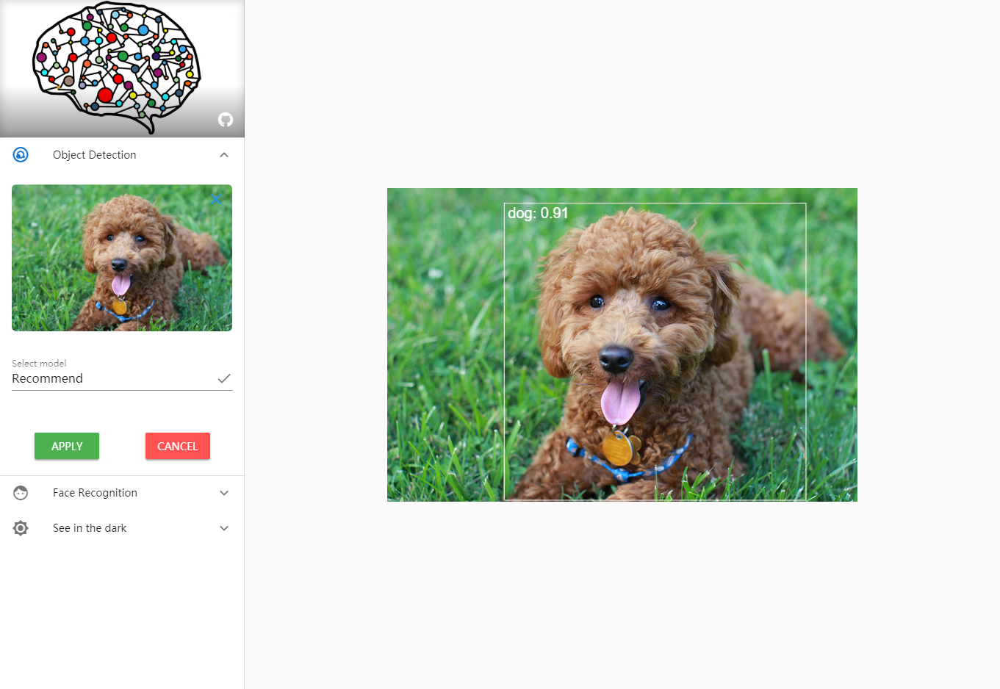

# mlip.js

The mlip.js is short for Machine Learning Image Process in TensorFlow.js.

## Style Transfer

### Info:

- Style Networks: MobileNet-v2
- Transformer Network: separable convolutions
- Input: Bitmap ( jpg/png etc. ) without size limit

### Result:

## Object Detection

### Info:

- Dataset: COCO
- Networks: yolo v2
- Input: Bitmap ( jpg/png etc. ) without size limit

### Result:

